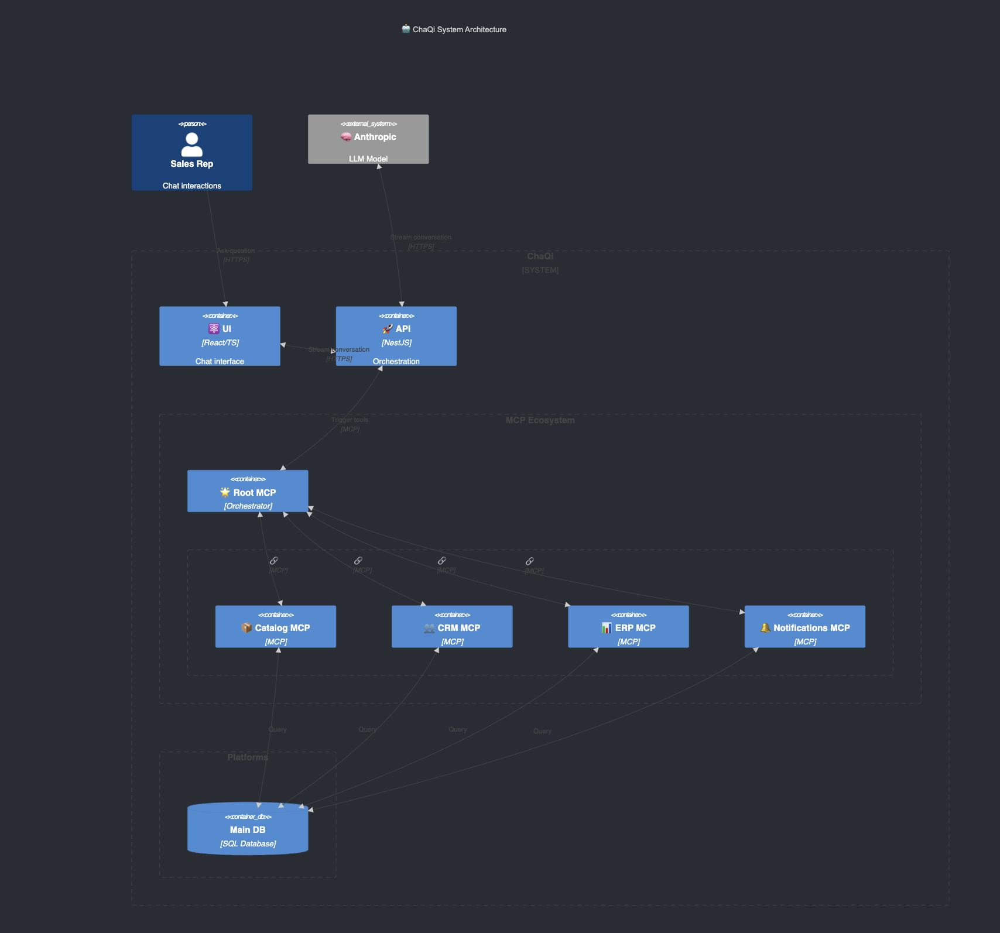
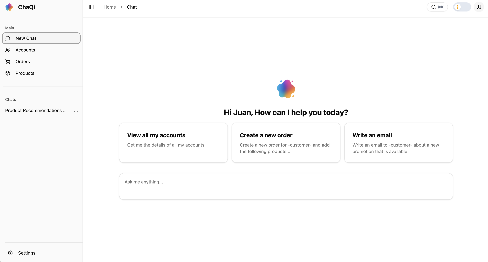

<div align="center">
  
  <h1>ChaQi</h1>
  <p>A comprehensive commerce platform with AI-powered features.</p>
</div>

<div align="center">
  
  
  
  
  
  
</div>

## Table of Contents

- [Table of Contents](#table-of-contents)
- [Quick Start with Docker](#quick-start-with-docker)
  - [Prerequisites](#prerequisites)
  - [Environment Setup](#environment-setup)
  - [Running the Services](#running-the-services)
  - [Environment Variables](#environment-variables)
    - [Database Configuration](#database-configuration)
    - [MCP Server Configuration](#mcp-server-configuration)
    - [Env Configuration](#env-configuration)
    - [Anthropic API Configuration](#anthropic-api-configuration)
    - [Client UI Configuration](#client-ui-configuration)
  - [Development](#development)
  - [Stopping Services](#stopping-services)
- [Architecture](#architecture)
- [Screenshots](#screenshots)
- [Built With](#built-with)

## Quick Start with Docker

### Prerequisites

- Docker and Docker Compose installed
- Anthropic API key

### Environment Setup

1. **Copy the environment template**:

   ```bash
   cp .env.example .env
   ```

2. **Configure your environment variables** in `.env`:

   ```bash
   # Required: Set your Anthropic API key
   ANTHROPIC_API_KEY=your-actual-api-key-here
   ```

### Running the Services

1. **Start all services**:

   ```bash
   docker-compose up --build
   ```

2. **Access the services**:
   - **Client UI**: http://localhost:80 (or http://localhost if using default port)
   - **NestJS API**: http://localhost:3000
   - **MCP Server**: http://localhost:8080
   - **PostgreSQL**: localhost:5432

### Environment Variables

The following environment variables can be configured in your `.env` file:

#### Database Configuration

- `POSTGRES_DB`: Database name (default: chaqi_db)
- `POSTGRES_USER`: Database user (default: pg)
- `POSTGRES_PASSWORD`: Database password (default: pg)
- `POSTGRES_PORT`: Database port (default: 5432)

#### MCP Server Configuration

- `MCPSERVER_PORT`: MCP Server port (default: 8080)
- `MCPSERVER_HOST`: MCP Server host (default: 0.0.0.0)
- `MCPSERVER_TRANSPORT`: Transport protocol (default: sse)

#### Env Configuration

- `DEBUG`: Debug mode (default: false)
- `ENVIRONMENT`: Environment (default: development)

#### Anthropic API Configuration

- `ANTHROPIC_API_KEY`: Your Anthropic API key
- `ANTHROPIC_MODEL`: Model to use (default: claude-3-5-haiku-20241022)
- `ANTHROPIC_SLIM_MODEL`: Cheaper model for testing (default: claude-3-haiku-20240307)
- `ANTHROPIC_MAX_TOKENS`: Maximum tokens (default: 4000)

#### Client UI Configuration

- `VITE_API_BASE_URL`: API url for the client to
- `CLIENT_PORT`: The UI port (default: 80)

### Development

For development, you can override any environment variable by setting it in your shell:

```bash
export ANTHROPIC_API_KEY="your-key"
export DEBUG=true
docker-compose up
```

### Stopping Services

```bash
docker-compose down
```

To remove volumes as well:

```bash
docker-compose down -v
```

## Architecture

<div align="center">
  
  <p><em>C4 Architecture Diagram</em></p>
</div>

## Screenshots

<div align="center">
  
  <p><em>ChaQi User Interface</em></p>
</div>

## Built With

- [React](https://reactjs.org/) - A JavaScript library for building user interfaces
- [Vite](https://vitejs.dev/) - Next generation frontend tooling
- [TypeScript](https://www.typescriptlang.org/) - Typed JavaScript at scale
- [Tailwind CSS](https://tailwindcss.com/) - A utility-first CSS framework
- [Shadcn/ui](https://ui.shadcn.com/) - Re-usable components built with Radix UI and Tailwind CSS
- [Zustand](https://github.com/pmndrs/zustand) - A small, fast and scalable state management solution
- [NestJS](https://nestjs.com/) - A progressive Node.js framework for building efficient, reliable and scalable server-side applications
- [AI SDK](https://ai-sdk.dev/docs) - TypeScript toolkit for building AI-powered applications and agents
- [Anthropic](https://www.anthropic.com/) - AI research company providing Claude models for natural language processing
- [Prisma](https://www.prisma.io/) - Next-generation ORM for Node.js and TypeScript
- [Python](https://www.python.org/) - Programming language for the MCP server
- [FastMCP](https://github.com/jlowin/fastmcp) - FastAPI-based MCP server framework
